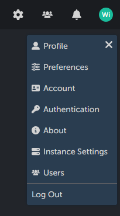
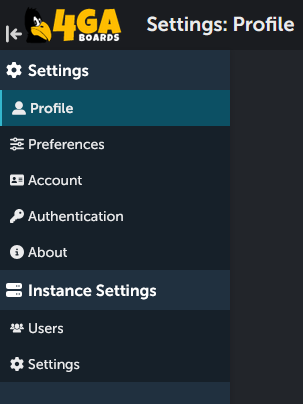

# Administration and settings
Here you will find explanation of all different features in the settings sections and administration panel.

## Levels of management

There are three levels of management in the 4ga Boards structure:
User/Member - the lowest level, they can only access those projects and boards they have been added to;
Project Manager - can manage everything inside the project, including adding new members to it and creating new boards;
Administrator - can access every settings in the instance and create new projects.

Each tier is unlocking special settings panel.

- For each user:
[Settings](./settings) will show you your personal settings.
- For project managers:
[Project settings](./project-settings) will guide you through settings of projects inside your instance
- For administrators:
[Instance settings](./instance-settings) will explain the settings of the instance (e.g. demo.4gaboards.com)

## Dashboard access to settings

If you are an administrator and you are manager of the currently opened project, your top-right corner of the dashboard will look like this:

If you click on your profile photo/name, you will open all the possible settings for your account:

To access the settings, click on the cog icon.

To access instance settings click on the users icon (to the right of the cog settings icon). It will not be visible if you don't have the administrator rights.

To quickly navigate the different settings, use the side panel - you can hide/show it using the bar&arrow icon next to 4ga Boards logo:

