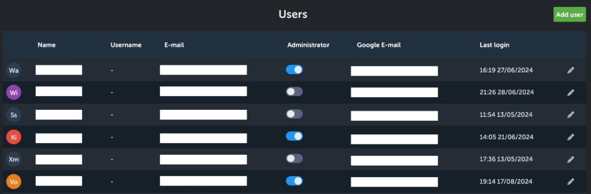
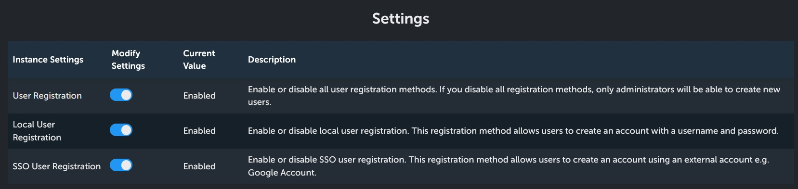

# Instance settings
As an administrator, you have control over instance possible login methods and users. To access it, click "Users" icon on the dashboard, or click one of the relevant options from the settings sidebar.

## Users
In the table you can see most important information about each user: name, username, e-mail (if they used Google SSO you will also see the google e-mail part), and last login time. Here you can also grant users administrator rights by toggling the switch blue.

You can manually add new users with the "add user" button here. If you have disabled user registration, new users cannot log into the instance if you didn't add them. To add new user you have to provide an e-mail, password, name and (optional) username.

As an administrator, you have control over users information. When you click on the pencil icon, you can access the all of the personal [settings](./settings)  of each individual user. You can change them all without knowing their current password. Pretty handy!

## Login options
- Users registration: turn off if you want to retain full control over new users (they will have to be added manually, see below).
- Local User registration: Turn on if you want new users to be able to register using e-mail and password.
- SSO User Registration: Turn on if you want to enable registration with Google account.

