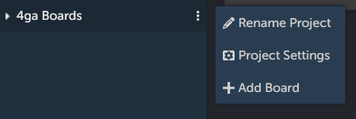
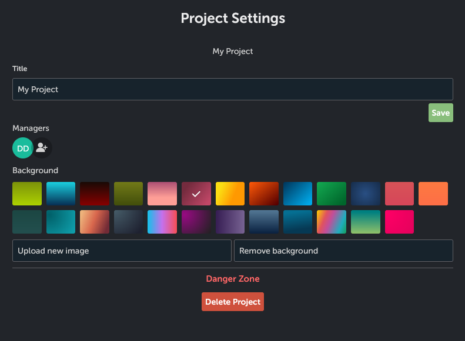

# Project Settings
If you are manager of the project that you are currently editing, click the "cog in the box" icon in the top-right corner next to `+ Add Board` button to access this project settings.

 	

Alternatively you can use ellipsis menu from the sidebar to access settings to any of your managed projects. Just hover over the desired project name and click on ellipsis icon.

When you choose the project you have options to change the title (click `Save` button to save changes),add or remove managers from the project and set the background image (with possibility to upload your own). The image will be visible in [projects view](./project). For extra caution, the `Delete Project` button was situated in the `Danger Zone`. And no worries, we added an additional pop-up for confirmation.

To go back to the project, click on arrow icon in the top-right corner or click the 4ga Boards logo to access [projects view](./project).
