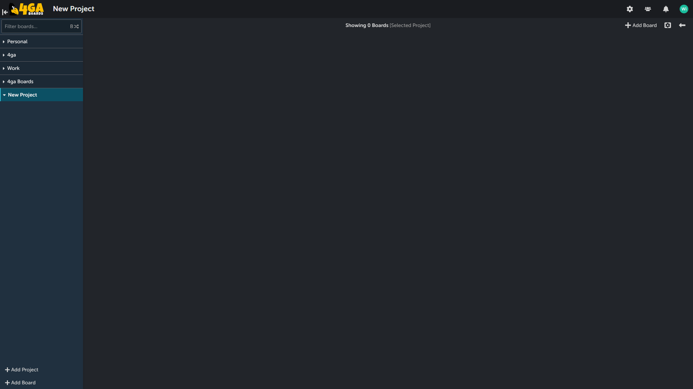
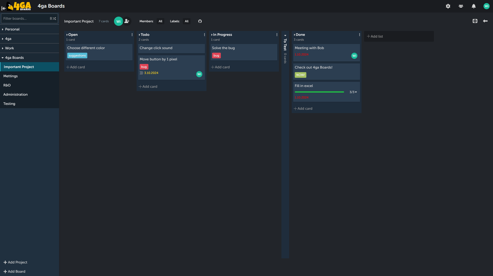
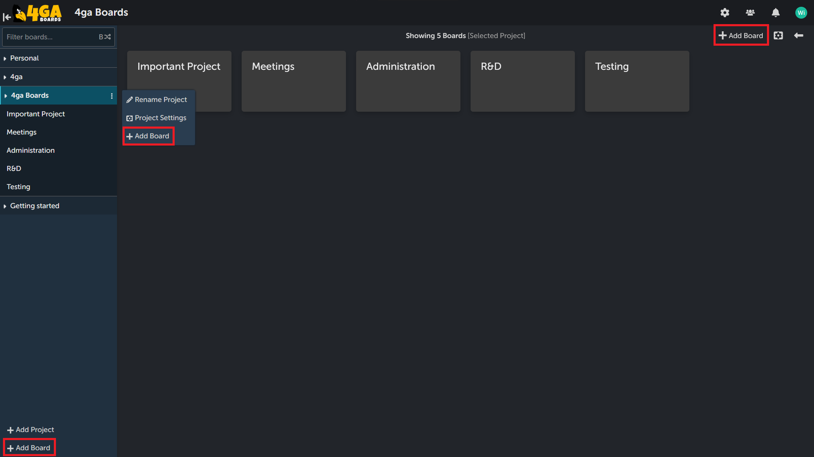
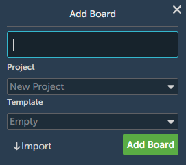
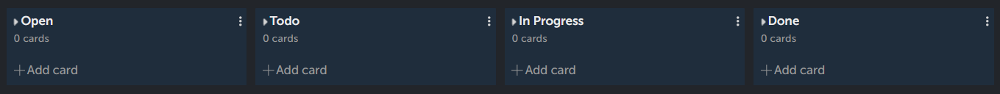
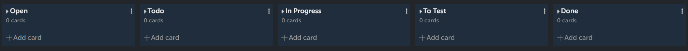
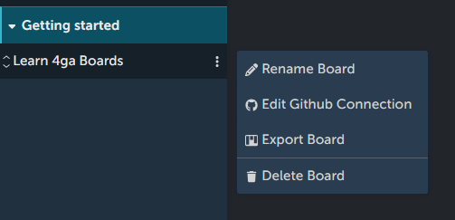
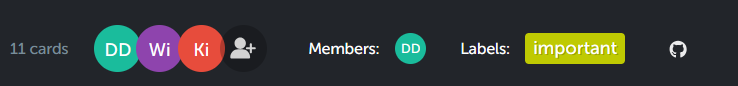

# Board
The heart of 4ga Boards is, unsuprisingly, a board. Board view is the main view of this app - you will spend here most of your time. Don't worry! It's easy to grasp. 
At first you will see that your project contains no boards - to create them, simply click the `+Add Board` button that is located at the bottom of the sidebar or at the top-right corner of the screen. 

If you are joining to an existing project, here is how it should look like:

Notice that selected board is highlighted in the sidebar view (in this example it is "Important Project" Board inside "4ga Boards" project).

## Creating a new board

There can be more than one board per project - simply click the `+Add Board` button that is located at the top-right corner of the screen to create new one inside the currently opened project. Alternatively you can add board using three-dot sidebar menu of a [project](./project) (it will create the board inside the selected project). The last option is to click the `+Add Board` button at the bottom of the sidebar. This will enable additional setting - choosing the project in which the board will be created from the dropdown list.

This will open up a pop-up window in which you can name your board, prefill the lists in the board with templates or import your data from 4ga Boards (in .csv file format) or from Trello (supporting .json file format).

Currently there are two available templates, simple:

And kanban:

## Board additional options

If you want to edit or delete your board, open the ellipsis menu in the sidebar (they will show after you hover over the board name). You can also change the order of the board within the project after clicking and holding the two arrows button that will appear on the left of the board name. If you wish, you can also export your board in .csv format here.

Each board comes with separate settings bar, in which (going from left to right) you can:

1. See the number of cards after filtering,
2. Add members to the board, 
3. Filter existing cards by members attached to them,
4. Filter cards by labels (also create/edit the labels).
5. Set up Github integration (WIP).

## Board permissions
Each member of the board can have different permission:

- Project manager: manage boards and add members,
- Editor:  can create and delete tasks and lists,
- Commenter:  can view contents of the board and comment on the cards,
- Viewer: can only view contents of the board.

