# Card

This section shows all of the possible actions that can be performed with a card, including labelling, notifications and extensive tutorial on description text editor. 

Card represents individual task, e.g. "Go buy groceries" or "Fix the wrong button placement".

## Creating, moving and deleting cards

To create a card you have two options:
1. Click on the `+ Add Card` button at the bottom of an existing list. 
2. Click the `ellipsis` icon at the top-right of the list and select `Add Card`. It will create card at the bottom of the list.

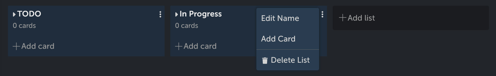

After you write the title of the card, press `Enter` or "Add card" button to create it; alternatively, you can press `Ctrl` + `Enter` combination to create the card and immidiately open it. To abort creating a new card, press `Cancel` or click in an empty spot on the board (this option will not work if you have filled the title; in that case, click the `Cancel` button).

The easiest way to move cards across the board is to drag and drop it in the desired place - just click and hold it! You can put card in both open and hidden lists. When dropping to the hidden list, it will be placed at the bottom of this list. To be sure which hidden list are you putting your card into, look if the title is pushed lower. In the example below, the card will be stored in "To test" list.

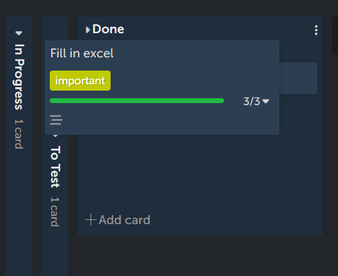

There are two other ways to move a card: with card menu (see below) and in the card view, right below the title (see Card options).

To delete the card, you have to move your mouse above the card you want to delete. After that, a three dot icon will appear. Click on it to open a card menu and select `Delete Card`.

## Card menu

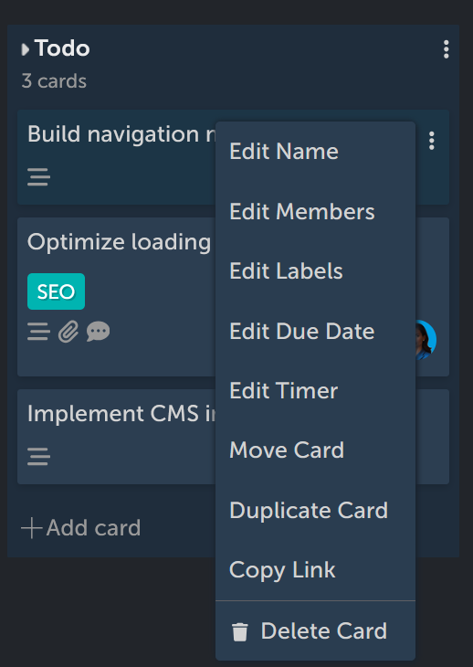 

After clicking the ellipsis menu in the card you will open a card menu. Here you can:

1. Edit the name of the card
2. Assing members to the card (see Card Options below)
3. Add/remove labels to the card (see Card Options below)
4. Edit due date of the card (see Card Options below)
5. Edit timer of the card (see Card Options below)
6. Move card to another project/board/list (note that this is the only way to move the card to another project or board, as drag & dropping the card works only on the lists in a current board)
7. Duplicate card, which will create exact same copy of the card directly below it in the list
8. Copy a link to a card which you can then share with your team
9. Delete card

## Card View overview
When you click on the card, the card view will show up at the right side of your screen. Why not on the centre? The unique feature of 4ga Boards is that you can manipulate the lists and boards while the card view is open.

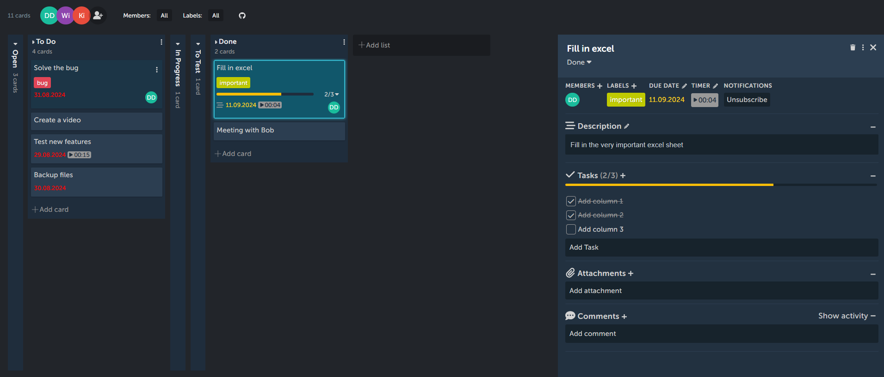

It is quite convenient if you want to rearrange your cards while still writing the description, or to simply appraise you beautiful card cover picture. Isn't it beautiful? 

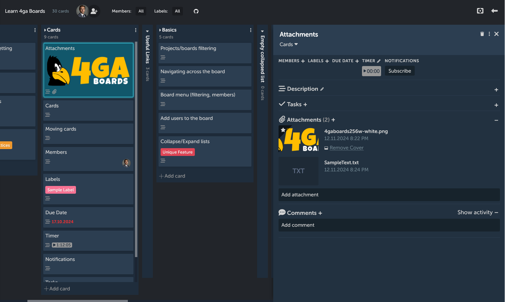

Also, notice that cards have different appearance that is changing with the amount of options and details set.

## Card options
The card view is the best way to change all the informations, options and details about your card. If the view gets cluttered, you can hide certain elements (description, tasks, attachments, comments) by clicking on the `-` icon next to them. Click the `+` icon to show them again. This section will explain all of them from the top to the bottom. 

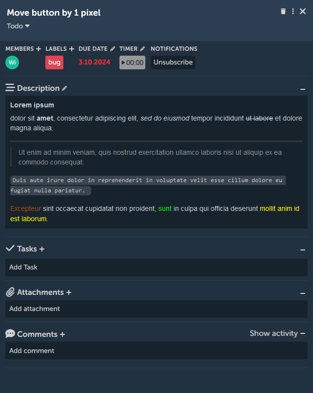

1. Title: you can click on it to change the cards title (`ENTER` to accept)
2. Card view icons on the top-right corner: click the `bin` icon to delete card (it will open pop-up to confirm deleting), three dots icon will open the card menu explained before, the `X` button will close the card view.
3. List selection: Below the title of the card, it shows in which list the card is situated. Clicking on it will open dropdown list. Here you can select in which list the card should be moved (it will appear at the top of the list).
4. Members: Click on the plus icon to toggle assigning members to the card. Tick symbol indicates whether the member is assinged or not. 

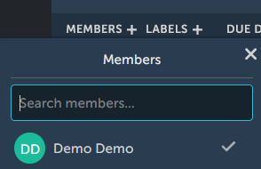

Note that only members that are added to the current board can be assigned to the card. If you don't see a member that should be available here and you are a project manager, add the member in [board options](./board).
1. Labels: Click on the plus icon to add labels to your card. Tick symbol indicates whether or not the label is used. You can also manage your labels here: create new labels (click on `Create new label`) or editing existing ones (click on the `pencil` icon). 

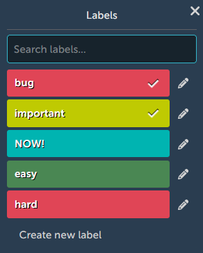 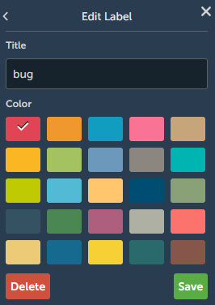

1. Due date: Here you can add (click on `+` icon)/edit (`pencil` icon) the due date for the card. If the due date is furhter than two weeks, it will appear grey; if it is in the range of two weeks - yellow; if overdue - red.

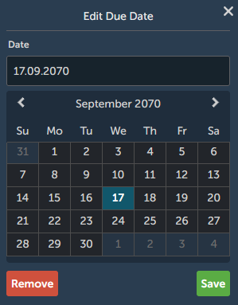

7. Timer: Using timer you can track the time it takes you to complete the task. Click on the timer to start/pause it, and click `pencil` button to edit the time manually or reset timer. When the timer runs it appears green. 
8. Notifications: Here you can subscribe or unsubscribe from the notifications on this card. While subscribed you will receive a notification (`bell` icon at the dashboard in the top-right corner) whenever someone adds comment to the card.
9. Description: Write the description for your card (to save click `Save` button or press `Ctrl` + `Enter`). See "Text editor" section below for a detailed guide.
10. Tasks: In this section you can add/edit tasks in your card or mark them complete. A small line indicates the portion of tasks completed, ranging from red to green. It remains empty if there are no finished tasks or when there are no tasks added.
    - To add tasks, click the `+` icon or `Add Task` button.
    - To toggle the task complete, click the square next to the task description.
    - To rename the task, click on the task description; upon finishing press `Enter` or click `Save`.
    - To delete task, hover over it until `ellipsis` icon appears; click it and select `delete task`.
    - You can toogle tasks visibility on the board: to do this, click on the `triangle` icon near the cards taskbar visible on the list.
    - Tasks can be assigned with a member or a due date: to do this click on the `ellipsis` icon and choose appriopriate option ("Edit Due Date" or "Edit Members"). This informations will be displayed at the right side of the appriopriate task. This can be done in both card view and directly on the board view (when tasks are expanded).

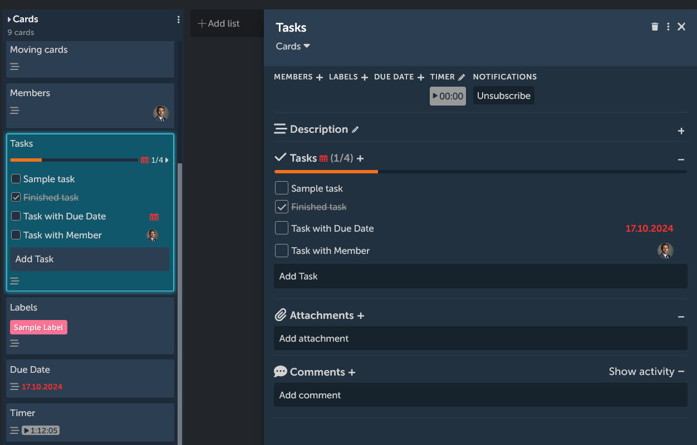

11. Attachments: Here you can add attachments to your card by either `Ctrl` + `V`, dropping them on the card or clicking on `Add attachment` field and selecting from the disc. If the attachment is an image, you can use it as a cover that will appear in the list view. To do this, click on `Make cover` button near the desired image. To remove cover, use `Remove cover` button. To remove the attachment completely, hover over it, click on the `pencil` icon and select `Delete attachment`.

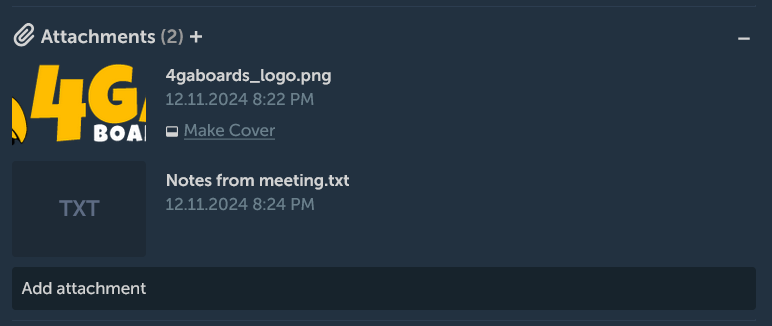

12. Comments: here you can add (start writing in the box and press `Ctrl` + `Enter` or `Add comment` button), edit (`pencil` icon) or delete (`bin` icon) coments to the card , using the same text editor as in the description field.

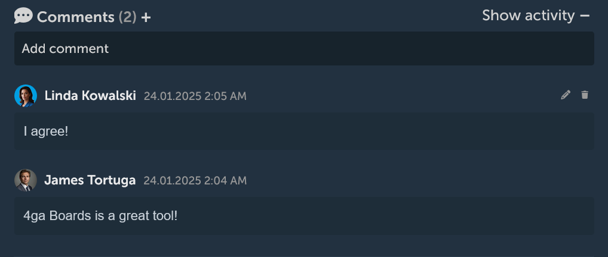

## Text editor

In 4ga Boards we are using very powerful markdown editor with unique features (marked by bold text). In the bottom-right corner of text editor box there are three small dots: drag them with a mouse to make the box bigger/smaller. The working view should look like this (notice the yellow text local changes - it shows that the text is still in edit mode and the changes are not yet registered on the server):

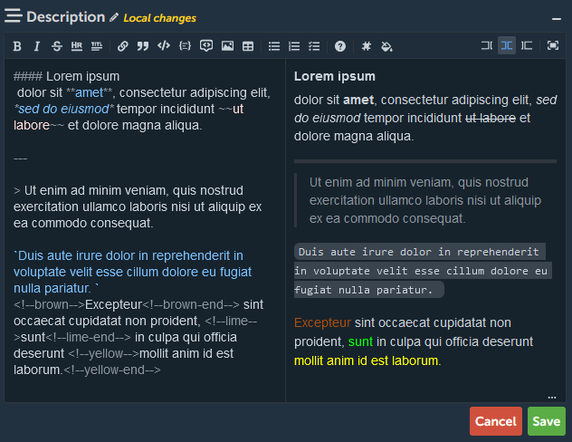


As the text editor is a markdown editor, it follows typical syntax to other editors like this. More detailed information on any of the options of the markdown editor can be found here: [basic syntax](https://www.markdownguide.org/basic-syntax/).

- Editor options are as follows (from left to right; you can click them or use button combination):
- Bold text (CTRL + b)
- Italic text (CTRL + i)
- Strikethorugh text (CTRL + SHIFT + x)
- Insert HR/horizontal bar (CTRL + h)
- Insert title (CTRL + number from 1 to 6, depending on the size); alternatively you can use hashtags.
- Add link (CTRL + l)
- Insert a quote (CTRL + q)
- Insert code (CTRL + j)
- Insert codeblocks (CTRL + SHIFT + j). After creating default codeblock, you can add **custom tags**:
    - The first tag just after opening symbol (` ``` `) is a language shortcut, e.g. ` ```js ` will highlight javascript syntax.
    - The second tag is for showing line numbers  ` ```js showLineNumbers `
    - The third that indicates which lines should be highlighted ` ```js showLineNumbers {1, 3-4} ` - in this example the lines 1, 3 and 4 highlighted.
- Insert comment (CTRL + /)
- Add image (CTRL + k)
- Add table
- Add unordered list (CTRL + SHIFT + u)
- Add ordered list (CTRL + SHIFT + o)
- Add checked list (CTRL + SHIFT + c)
- Open help (opens the [basic syntax](https://www.markdownguide.org/basic-syntax/) site)
- **Add issue link - with this feature you create a link from card to GitHub issue or pull request. Some ways to do it:**
    - click the add issue button and type issue or PR number or write: #(number of the issue), e.g. `#1`.
    - instead of hashtag you can use: GH-(number), e.g. `GH-1`
    - to link issue or PR in fork use: (fork name)#(issue number), e.g. `samplefork#1`
    - to link issue or PR in specific repository use:(username or organization name)/(repository name)#(issue number), e.g. `RARgames/4gaboards#1`
- **Add colored text**
    - use button to select desired color or type in color name like in the example: `<!--black-->This text wil be black<!--black-end-->`
    - available colors: black, grey, white, brown, red, purple, pink, green, lime, yellow, blue, cyan, orange.

View options:
- Edit code (ctrl + 7) - shows only the edited text with markdown symbols
- Live code (ctrl + 8) - shows both markdown symbols (on left) and live preview of the text (on the right)
- Preview code (ctrl + 9) - shows just the text preview
- Toggle fullscreen (ctrl + 0)

Some functions that don't have special buttons:
- **Add commit link**  - type:
    - to link commit use (commit hash), e.g. `1d7e95e8d496564ac5f69a06db60df79a6a585c4`
    - to link commit in fork use (fork name)@(commit hash), e.g. `samplefork@1d7e95e8d496564ac5f69a06db60df79a6a585c4`
    - to link commit in repository use (username)/(repository name)@(commit hash), e.g. `RARgames/4gaBoards@1d7e95e8d496564ac5f69a06db60df79a6a585c4`
- **Add mention** - type:
    - to mention user use @(username), e.g. `@RARgames`

Alternatively you can paste links to link commit, commit comment, issue or PR, issue or PR comment, user.

Special power: if you have read so far, you can use special ability: add invisible comment with: `<!-- This comment will be invisible so I can say whatever I want -->`
