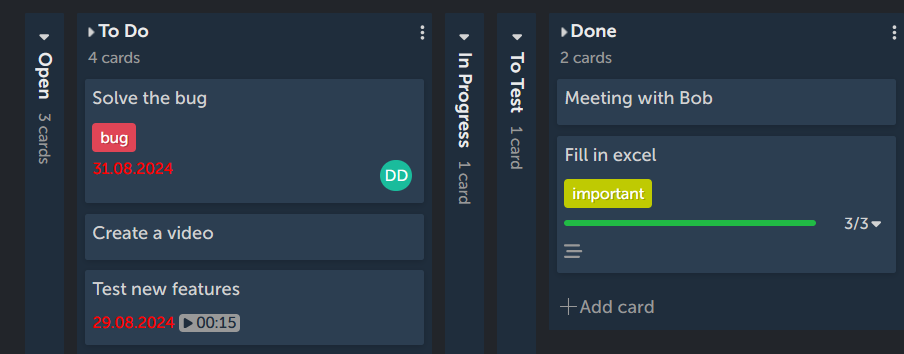

# List
In 4ga Boards, lists are columns on the board representing different stages or categories of the workflow. For example, kanban board template comes with 5 empty lists:

## List navigation
To move list into different spot on the same board, simply drag and drop it where you want. You can't, however, move a list to different board or project.

If you have many lists that don't fit in a browser window, you can move around by using `Ctrl` + `Scroll`, holding on an empty space in the board (when a hand icon is visible) or by using scrollbar at the bottom.

If the list is full of cards, you can scroll through them using mouse scroll (while hovering over the list) or with scrollbar at the right side of the list.

You can hide/unhide all lists (empty or with cards) by clicking on the little triangle button in the top-left corner of the list (right next to its name). This feature is very handy for decluttering your board view and/or hiding unnecesarry lists. Hidden list will have the number of holded cards displayed on them (see screenshot).

## Creating, editing and deleting the list
To create a list, click on the "+add list" button on the board, write a name and confirm it by clicking on the green "Add List" button. It will automatically open a new pop-up window to create a next list. If you don't want to do it, simply click "Cancel" or start doing anything else and it will automatically close.

You can edit the list name by clicking on the three dots in the top-right corner of a list. It will open a menu, in which you can also add card and delete list (clicking it will open an additional confirmation pop-up). By clicking on "Add Card" you can create a new card at the bottom of the list.

