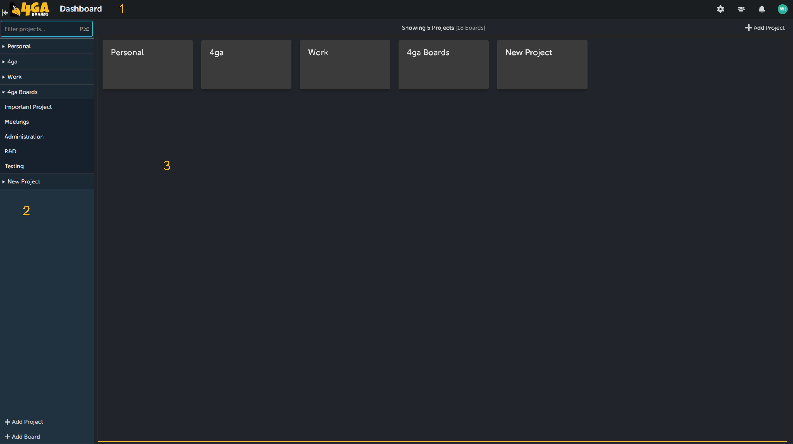
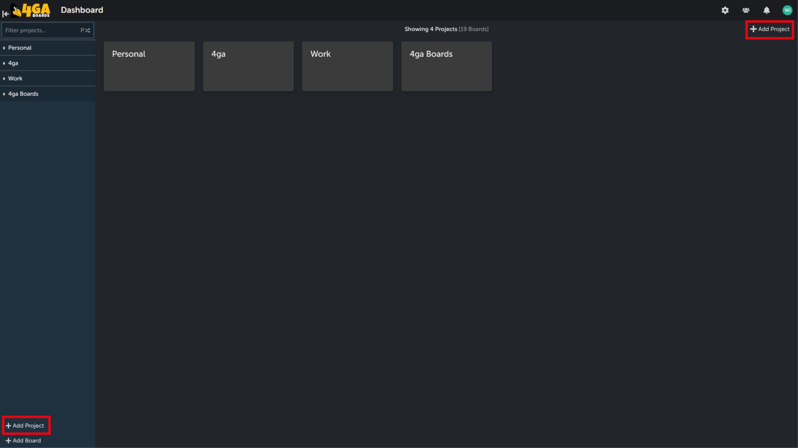

# Project
Projects are the highest structure of 4ga boards workflow. All of the projects can be accessed from the dashboard view (3) or using the sidebar (2).

If you ever wish to come back to dashboard view, you can do so by clicking 4ga Boards logo in header (1). In addition, if you have administration rights to any of the projects, you can customize them in [project settings](./project-settings).

To create a project, simply click on the "+Add project" button. This button is located at the bottom of the sidebar or at the top-right corner while you are in the dashboard. After clicking one of the buttons, the prompt for naming the project will appear.

NOTE: If you don't see the option to create project it means you lack the administrator rights. In this case you can only use the projects you were already added to by the administrator.

To access quick menu for the projects (available for project managers) hover over the project name and click three dot button. In this menu you can rename your project, go to [project settings](./project-settings) or add a new [board](./board).

After you create your first project, click on its tile in the dashboard or on its name in the sidebar to see the [board view](./board).
