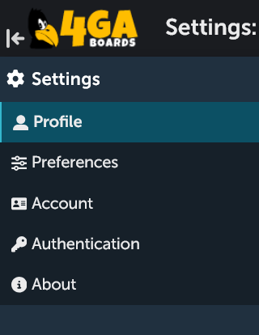
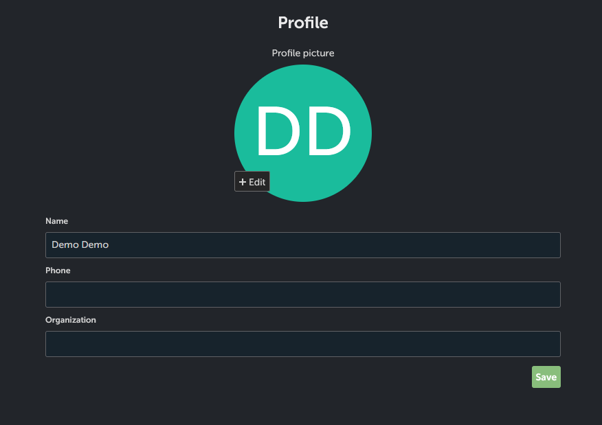
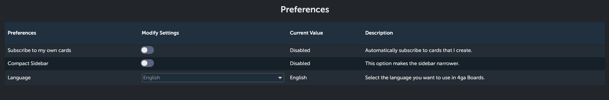
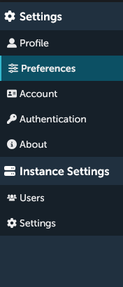
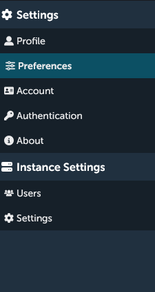
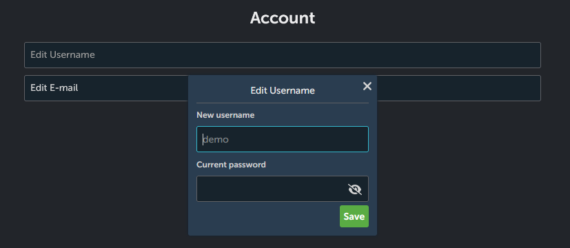
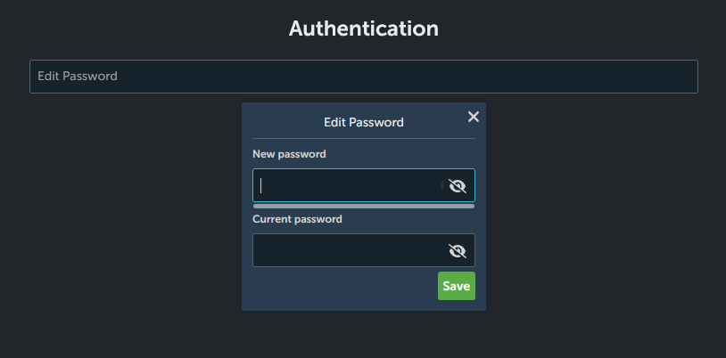
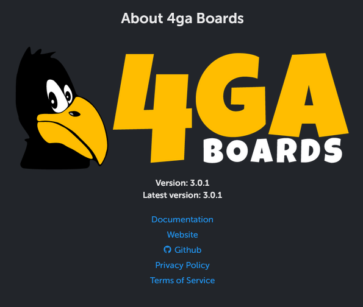

# Settings

The personal and general settings panel looks like this:

## Profile
In the profile settings you can add an avatar (from the disc), change your displayed name and add additional informations such as phone and organization name. Remember to click on the `Save` button!

## Preferences
In the preferences section you can choose the language in which you will see 4ga Boards. You can also set if you want to be automatically subscribed to the cards created by you (see [card](./card#card-options), card options section).

The option "Compact sidebar" let's you choose the style of your sidebar (applicable for both settings and board sidebars). 
If you enable it, you sidebar will be slim. This option is great if you prefer minimalistic design and more room for your lists in the board view. 

If you disable it, the sidebar will be bulkier, which might be useful if you have long project names.

## Account
Here you can change your username and/or e-mail adress. For both changes you will need to input your current password.

## Authentication
Here you can change your current password.

## About
Section providing information about your current build version, latest available version of 4ga Boards and useful links: [4ga Boards](https://4gaboards.com), [GitHub](https://github.com/RARgames/4gaBoards), [Privacy Policy](https://4gaboards.com/privacy-policy) and [Terms of Service](https://4gaboards.com/terms-of-service).

