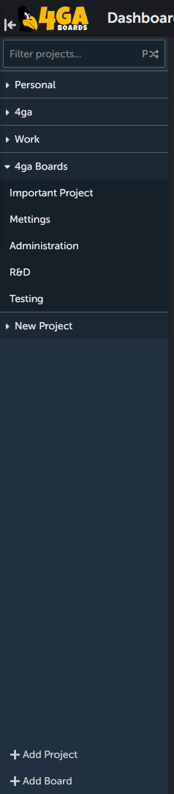
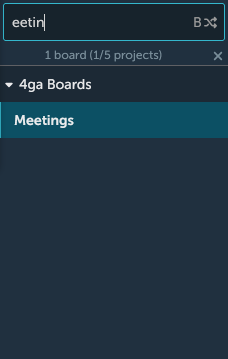

# Sidebar

All the time while using the 4ga Boards you can use the sidebar. It let's you quickly manage and navigate thorough your projects and boards. Here is how it looks like:

### Some actions you can perform within sidebar:
1. You can change sidebar width inside [personal settings](./settings).
    - You can show/hide the sidebar using the bar and arrow icon in the top-left corner, left of 4ga Boards logo.
2. You can filter your projects or boards using the filtering function at the top of the sidebar. The two arrows icon with a letter indicates which structure is being filtered: projects (P) or boards (B). To switch, click on the icon. As you can see in the example below, filtering works also if you write the middle part of the word. To clear filtering, click on the "x" icon.

1. You can show/hide the boards in projects using triangle button on the left of the project name. It will show all of the boards within this project that you have access to (unless there is an active filtering hiding some of them).
2. You can quickly navigate between different projects/boards by clicking on their names. Selected project/board will be highlighted with blueish color.
3. You can edit project/board within sidebar using a three-dot menu (see [project](./project) and [board](./board)).
4. If you have appriopriate permissions, the buttons `+ Add project` and `+ Add board` will be visible at the bottom of the sidebar.
