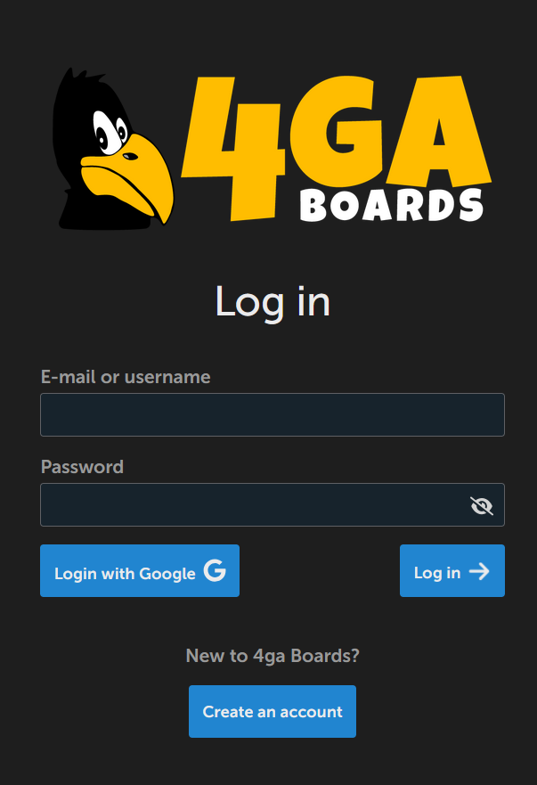
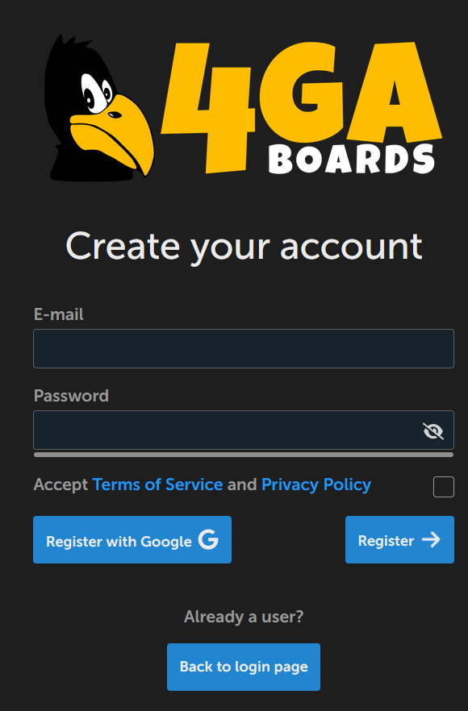

# Installation and creating an account

If you succesfully deployed 4ga Boards or your organization has already provided you with working one, it is time to create your account. To do this, simply go to the web adress of your 4ga Boards.

To try out 4ga Boards, you can go and register in the [demo instance](https://demo.4gaboards.com/). It's limitations are described here: [Try 4ga Boards](https://4gaboards.com/try).

If you don't have an account yet, you can register by clicking "Create an account" button. Remember to choose a strong password and accept the "Terms of service" and Privacy Policy".

 

If you/your organization have enabled SSO sign-in you can register using your Google account (currently, only Google SSO is supported).

If you cannot register with both methods, it means the administrator of your instance disabled the registration. Ask your administrator to add you manually.
