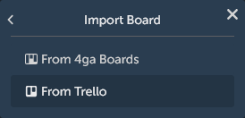
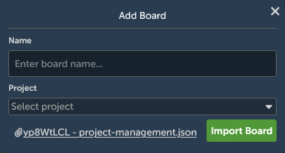
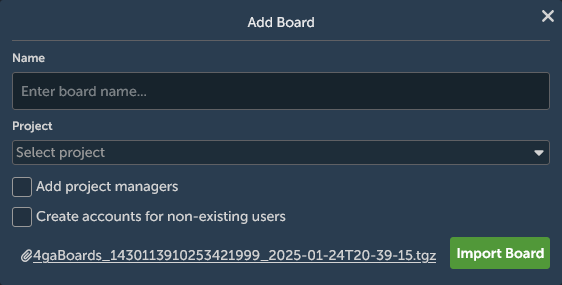

# Import/Export

## Import from Trello

Are you migrating from other software?\
Currently 4ga Boards is supporting migration from Trello. To do this, export your Trello board in .json format (the only one included in the free version of Trello) and do the following:

1. Create new board and select "Import":

2. Select appriopriate option for import:

3. In the file manager select the appriopriate `.json` file, name your new board and choose in which project it should be created. Think of the project for now as kind of Trello's workspaces - a container that holds boards. More on project [here](./project).

 

 And done! Now you have a fully functioning board - also with labels!

 ## Import from 4ga Boards

 Changing instances or copying board from another user?\
  With the 4ga Boards import you can quickly setup your workspace. Be sure you have an appriopriate 4ga Boards export file (it should have a `.tgz` format) and do the following:

 1. Create new board and select "Import":

2. Select appriopriate option for import:

3. In the file manager select the appriopriate .tgz file, name your new board and choose in which project it should be created. Here you can also check two options regarding users:
   - `Add project managers`: New managers will be added to the project if they had the same role in the exported board.
   - `Create accounts for non-existing users`: New accounts will be created for users that does not exist in the current 4ga Boards instance, but were members of the board in the exported board.

 

 ## Export

Exporting in 4ga Boards is quick and easy. Simply open the context menu of the board you wish to export and select the `Export Board` option. Save the resulting `.tgz` file to your preferred location.  

